# Introduction

During the hackathon our group implemented a backend module that allows users to react to messages using named ReactionTypes.

The module supports single reaction per user per message. Users can also remove a reaction they previously added. Pinned posts and messages are persistent across sessions and isloated for each user profile.

The module was built as an augmentation of the provided miniproject. We followed the course constraints (no signature changes except where allowed) and implemented the following tasks required by the hackathon specification, plus a few extra quality and UX improvements.

# About our app

This Android application is a social platform that allows users to create, share, and interact with posts in real time. 

Users can register or log in, browse posts from others, search by keywords, and create new posts of their own. 

The app features a rich, interactive interface with post pinning, dark mode, and integrated discussions where users can react and comment dynamically. 

Built with modern Android tools and following the latest SDK (Android 16 ‘Baklava’) standards, this project demonstrates seamless navigation, responsive UI design, and personalized experiences through user profiles and theming.

# Requirements

- Android Studio
- Compile, Minimum and Target SDK version 36 (Android 16 'Baklava')
- Java Version 17 or above

Testing was done on virtual device of Google Pixel 9A. Optionally, any other Medium phone also works.

# What We Implemented

All hackathon tasks (1–5) were completed as a group. In addition we added some front-end facing features and quality improvements.
**New / completed functionality:**

- User authentication: sign up and sign in flows implemented (passwords are hashed).

- Pinning and Unpinning: users can pin posts and messages so they remain visible in the pinned area. They can also unpin the posts with the same gestures for pinning.

- User home page: each user has a home page that lists their posts and basic profile details.

- Profile photo upload: user can upload a profile photo from the camera roll.

- Reactions: users can react to messages by clicking an emoji and unreact by clicking the same emoji again.

- Posts: users can add new posts.

- Search: users can search posts by keywords, topic, message and author name.

- View other users' profile pages to see their posts and profile.

- Reactions tracking: backend keeps track of which reactions each message has and counts for each type.

- Persistence of reactions and pinning to disk between runs (efficient format).

# App Walkthrough

## 1) Login and Register

Once the app is running you'll be greeted with the **Login** page.

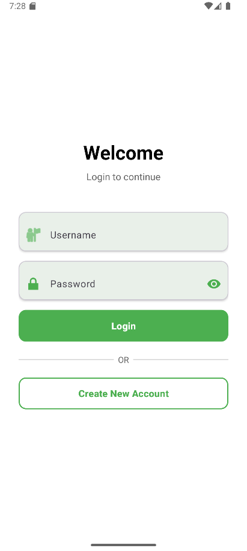

Navigate to "Create new account" to **Register**. Choose a username and password of your choice to create a new account. If the username already exists you'll have to choose another username.

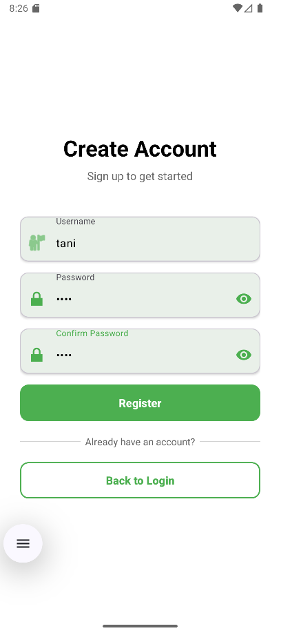

After registering you'll be navigated back to the login page where you can now login with your account.

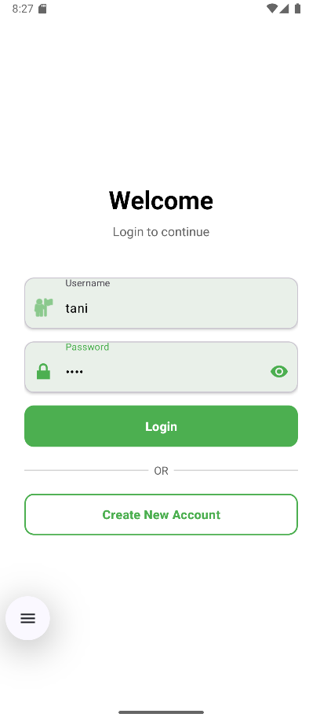

## 2) Home page

After logging in you'll be navigated to the **home page** of the app. Here you can view all the posts made by other users and you sorted by the time of creation.

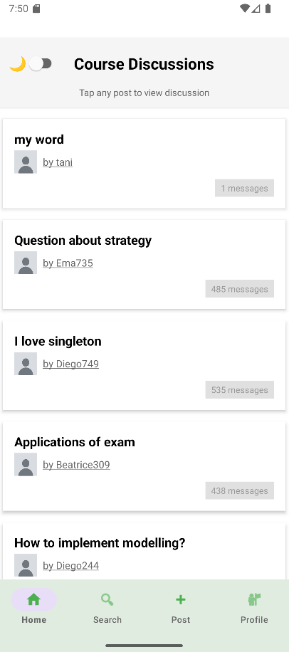

## 3) Search Page

Navigate to the **search page** from the **bottom navigation bar** to search up posts by keywords, topic, message or author name.

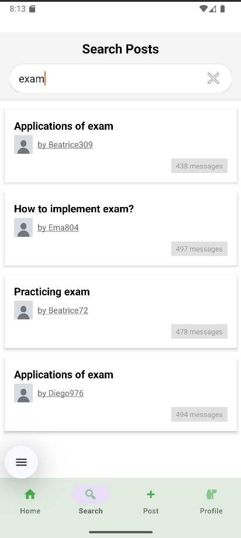

## 4) New Post Page

To create a new post, navigate to the **post page** from the **bottom navigation bar**. Give a meaningful title and description to your post and hit submit.

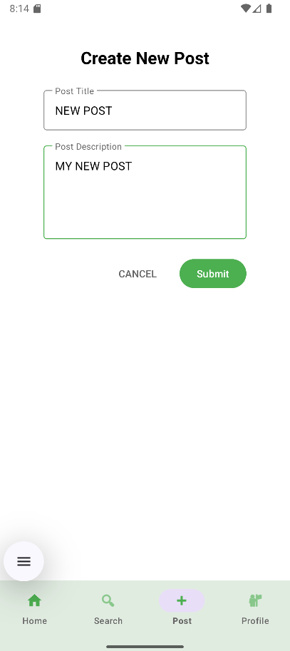

Your new post would now appear in the home page of the application.

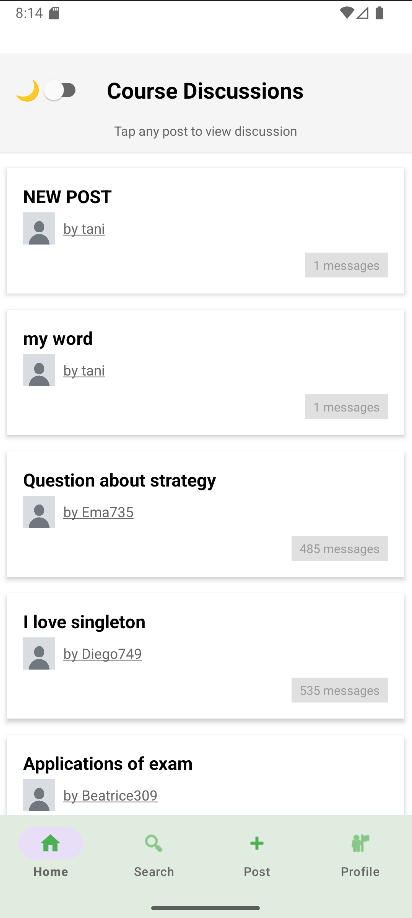

## 5) Dark Mode 

You can change the **theme** of the app from **light mode** to **dark mode** and vice-versa by clicking on the **change theme** button at the top left of the home page.

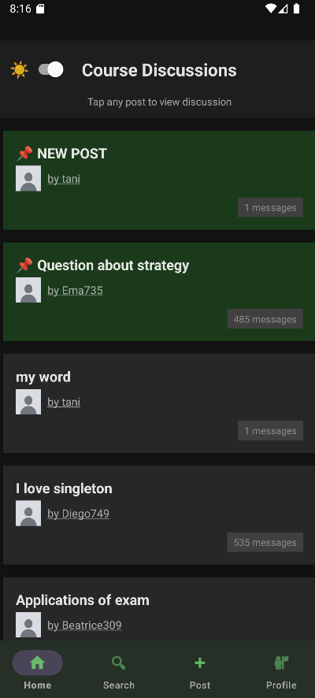

## 6) Pinning posts

You can **pin** posts made by **you** and by **other users**. If you wish to pin a post, there are two ways you can do so.

#### Method 1: Dragging a post to left

An option would appear if you wish to pin the post. Confirm to pin the post at the top of your home page. 

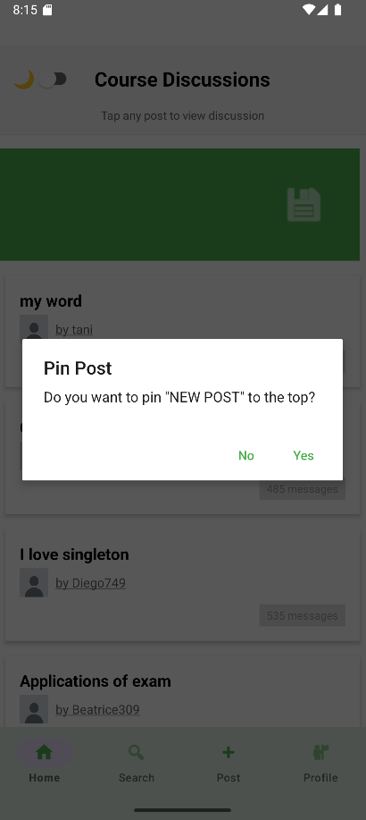

#### Method 2: Long press on a post

You can long press on a post and again an option would appear if you wish to pin the post or cancel.

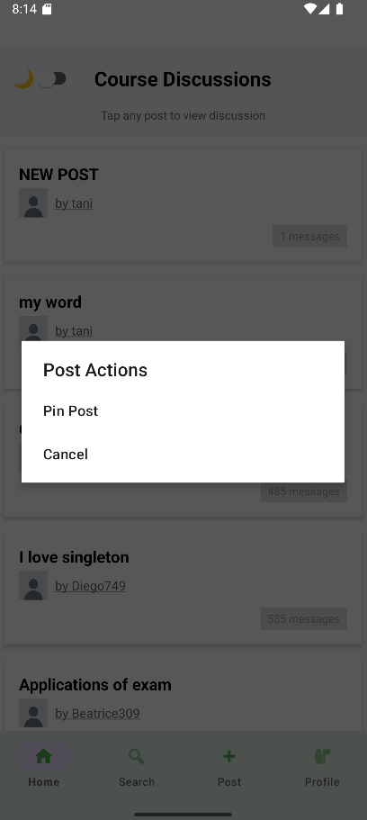

After pinning a post it would appear at the top of your home page.

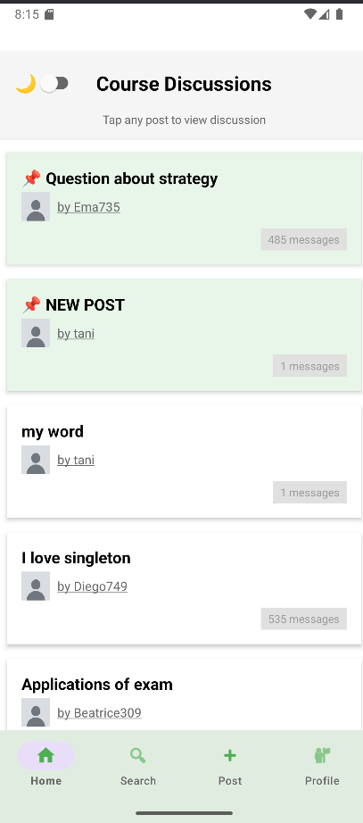

If you pin a post by you it would also appear in your profile page at top.

You may also **unpin** a post by using the same gestures used for pinning the post.

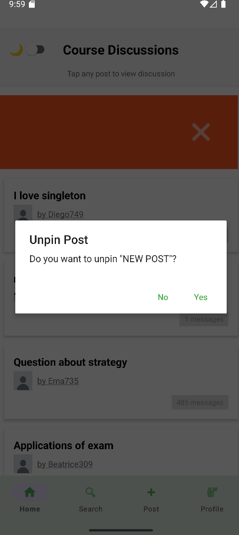

## 5) Profile Page and Changing Profile Picture

Navigate to the **profile page** from the **bottom navigation bar** to view your profile page. 

Optionally, you can also click on your username on a post you made to view your profile.

From here you can **change your profile picture**, **logout from your account** and **view all posts** by you including posts of yourself that you **pinned**.

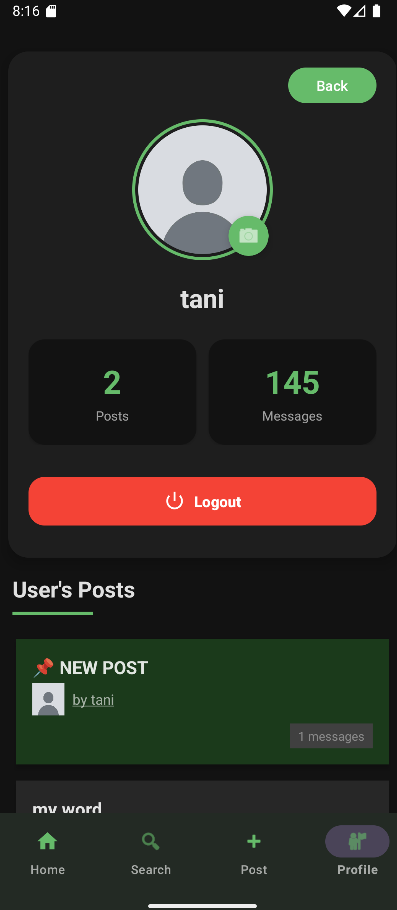

To change your **profile picture**, click on your profile picture and **upload** a new one.

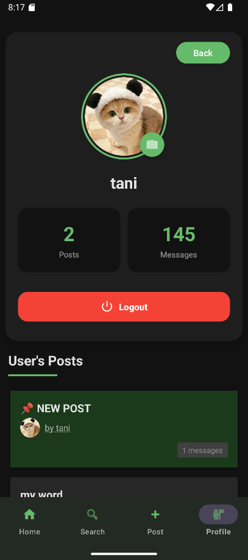

## 7) Other Users profile

To view any other user's profile, click on their **username** from any post they made and you'll be navigated to their **user profile page**.

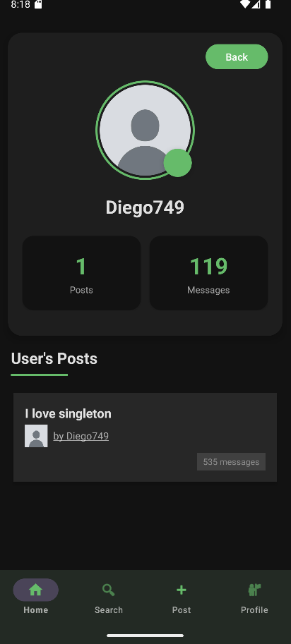

## 8) Messages and Discussion

Click on any post you want to view discussions of.

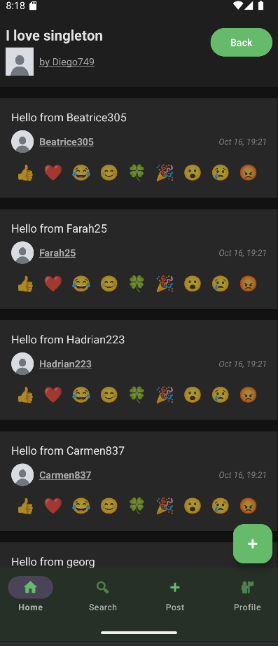

From here, you can **view messages from you and other users**, you can **react to their messages** or **write messages** of your own.

## 9) Reactions

To make a **reaction to a message**, click on any **reaction**. For a message you can at max make only one reaction.

You can also **view the count of reactions** on a message. 

Logging in from a different account, you can react to a message as the **same reaction type** as others, or a **different reaction type**.

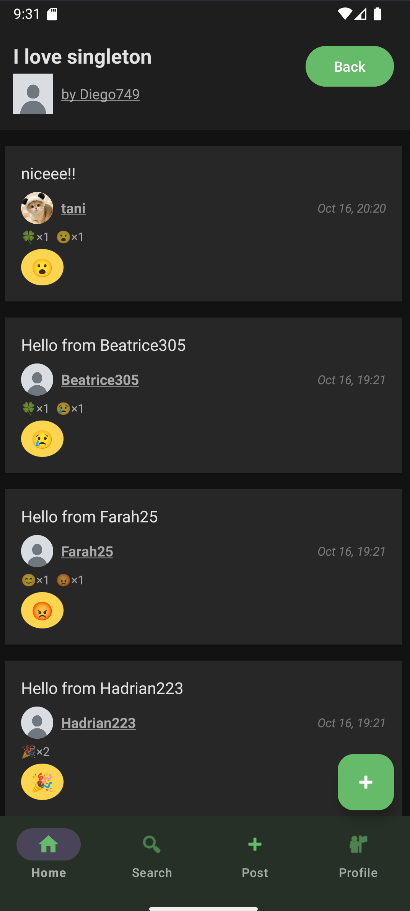

## 10) New Message

To write a **new message** for a post, click on the post and then the green **+** button at the **bottom right corner**.

Now write your message and click **Submit**.

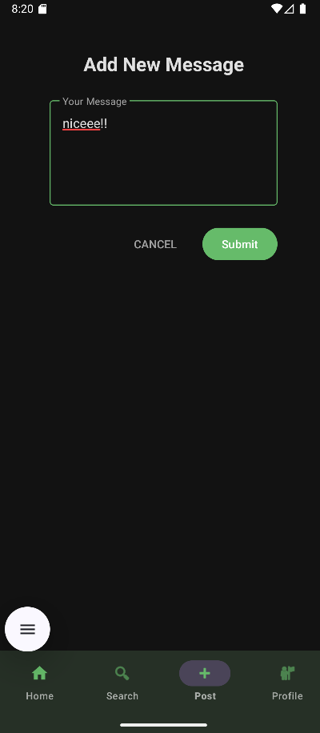

Your **new message** would now be visible for the **post's discussion**.

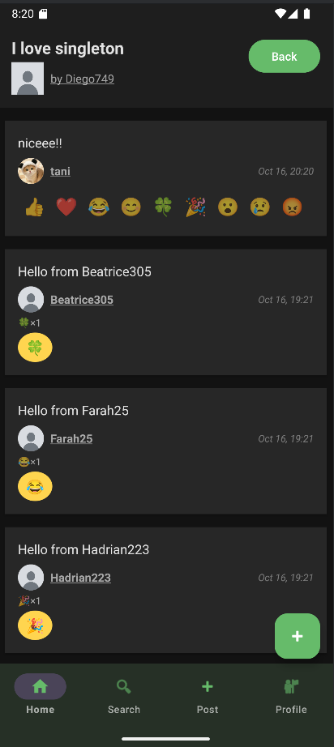

## 11) Pin Message

You may also **pin or unpin a message** under a post discussion using the same gestures used to pin a post.

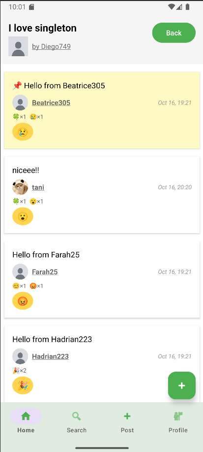

## 12) Logout

To **logout**, go to your profile page and click on the logout button. You'll be navigated back to the **Welcome login page**.

# Core features (detailed)

## 1) Authentication (Sign up / Sign in)

Users can create accounts and authenticate. Passwords are hashed before being stored in the persistent user store. We use a standard hashing + salt approach (see auth package).

On successful sign-in we return a session token (or standard in-memory session), depending on the environment.

## 2) Posting, pinning and unpinning
Users can create posts with a topic and body.

A post (or a message within a post thread) can be pinned and unpinned.

## 3) Profile photos
Users can upload a profile image from their device camera roll. 

## 4) Reactions

Representation: A Reaction object contains at least the fields: userId, messageId, reactionType, and timestamp.

Behaviour: A user may add any number of reactions to a message but only one per reaction type. 

Adding an already-existing (same user, message, reactionType) reaction is a noop. 

Removing a reaction removes only the matching reaction type for that user-message pair.

## 5) Search
Posts can be found by topic. The search engine is a simple in-memory index (topic → post ids) updated on post creation.
